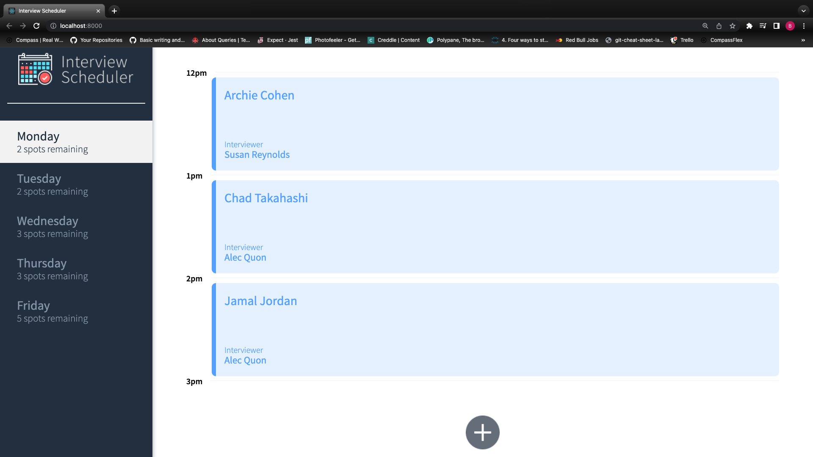
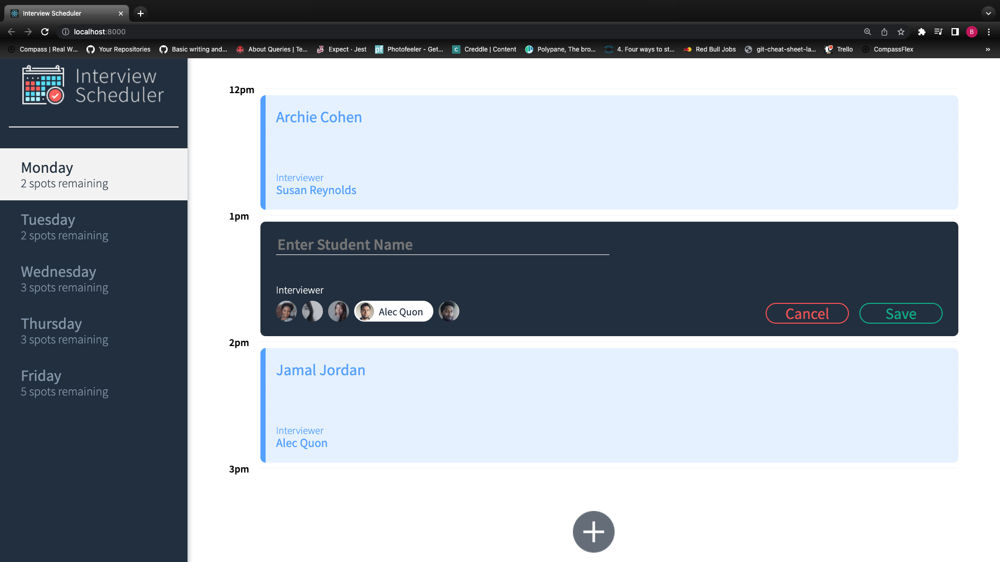

# Interview Scheduler

Interview Scheduler is a Single Page Application where you can add, edit, or delete interview appointments. It is a ReactJS app that relies on an API server using a PostgreSql database. This project was developed using the Test Driven Development method. Individual components are tested seperately, and End-to-End testing has also been completed.

## Features

- User can switch between days
- Detailed information is displayed on each appointment
- User can book interviews by typing in their or another students name, as well as select their desired interviewer from a list
- An existing interview appointment can be canceled, with a confirmation message for extra security
- User can clearly see which days are available or taken

## Setup

Install dependencies with `npm install`.

## Running Webpack Development Server

```sh
npm start
```

## Running Jest Test Framework

```sh
npm test
```

## Running Storybook Visual Testbed

```sh
npm run storybook
```

## Images




## Stack

Front-End: React, Axios, HTML, SASS, JS
Back-End: Express, Node.Js, PostgreSQL
Testing: Storybook, Jest, Cypress

## Dependencies

- Axios
- Classnames
- Normailze.css
- React
- React-dom
- React-hooks-testing-library
- React-scripts
- Babel/core
- Storybook/addon-actions
- Storybook/addon-backgrounds
- Storybook/addon-links
- Storybook/addons
- Storybook/react
- Testing-library/jest-dom
- Testing-library/react
- Prop-types
- React-test-renderer
- Sass

